# Beesline
Beesline Apitherapy is a website that provides cosmetics, and body and skin care products for customers all over the world.

# Build Admin Dashboard:

> Requirements:
 1. Design Of Dashboard including Header, Footer, SideBar :).
 2. Dashboard -> Prdoucts (CRUD): Create New Product, Read All Products, Show Prdouct Details, Update Product, Delete Product.
 3. Orders: Show all Orders, Show the details of any order(username,date,totalPrice,Product Titles only), change the status of any order (Pending (Default), Accepted, Rejected).
 4. Admin can login with pre-registered (Email & Password).
 5. Search Bar By Product Name :).
 6. There is Profile for admin as User :) , and he can edit it also :).
 
> Setup Repo:
 1. Clone The repository `git clone https://github.com/oassem/Beesline/tree/main`.
 2. Create New Branch `git branch laila_branch`.
 3. Stand on the branch `git checkout laila_branch`.
 4. install Node Packages ` npm install`.
 5. run the angular project by `ng serve -o`.
 
> Phase (1) - Design the structure of pages :)
  1. start to Empty `app.component.html` file but keep `outer-outlet` tag :).
  2. Install `angular material`by run this command line `ng add @angular/material`with choose `Indigo/Pink` Theme with `angular Animations Module`with Global Angular Material Typography styles `html, body { height: 100%; }body { margin: 0; font-family: Roboto, "Helvetica Neue", sans-serif; }`
  3. Install `high charts` by run this command line `npm i highcharts-angular --save` with the help of [highcharts-angular npm](https://www.npmjs.com/package/highcharts-angular) and run this command `npm i highcharts --save` with the help of [Highcharts npm](https://www.npmjs.com/package/highcharts).
  4. Install `Flex Layout` Packages by run this command line `npm i @angular/flex-layout @angular/cdk --save` with the help of [angular flex-layout npm](https://www.npmjs.com/package/@angular/flex-layout) and [Angular cdk npm](https://www.npmjs.com/package/@angular/cdk).
  5. In `app.module.ts` add `MatButtonModule` in imports :) with `import {MatButtonModule} from '@angular/material/button'`
  6. add `mat-raised-button` for testing in `app.component.html`.
  7. remove the previous matButton and its' imports :) and complete :).
  8. Create The first Layout by run this command line `ng g c layouts/default` and create its' module by `ng g m layouts/default`
  9. Create a component for the Dashboard Page by run this command line `ng g c modules/dashboard`.
  10. open `app.module.ts` remove `dashboard component` from declarations and its imports :).
  11. open `default.module.ts` add `dashboard component` in declarations and its imports :).
  12. Use The first Layout as a Parent Route component in `app-routing.module.ts` and the Dashboard Page as Child Component as in`{ path:'',component:DefaultComponent,children:[{path:'',component:DashboardComponent,loadChildren: () => import('./layouts/default/default.module').then(m => m.DefaultModule)},]}`.
  13. add in `default.component.html`-> `router outlet` tag :) and add `RouterModule` in imports of `default.module.ts`.
  14. See in the same path of default component -> Dashboard working :) as in 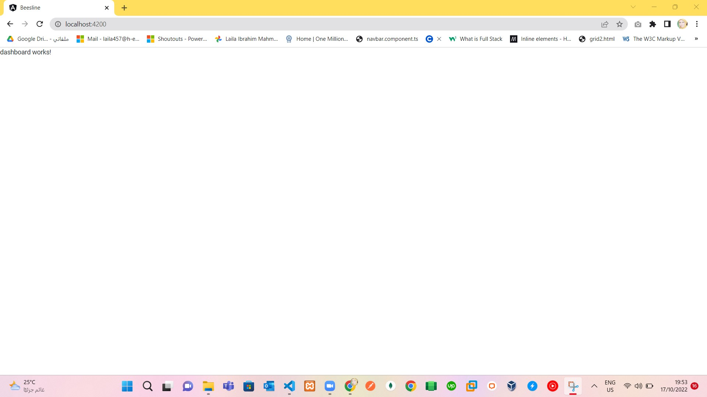.
  15. Create a shared Module for the header, SideBar, and Footer components by `ng g c shared/components/header` , `ng g c shared/components/footer` and `ng g c shared/components/sidebar`.
  16. remove `headerComponent`,`footerComponent` and `sidebarComponent` and its imports from `app.module.ts`.
  16. Update the Shared Module and add these components in the declarations and Exports sections.
  17. add products and orders components :) y `ng g c modules/products` and `ng g c modules/orders`.
  18. remove `ProductsComponent` and `ordersComponent` and its declarations from `app.module.ts`.
  19. Add `ProductsComponent` and `ordersComponent` and its declarations to `default.module.ts`.
  20. Add path of products and orders to children of default path :) in `app-routing.module.ts` as  `{path:'products',component:ProductsComponent,loadChildren:()=>import('./layouts/default/default.module').then(m=>m.DefaultModule)}, {path:'orders',component:OrdersComponent,loadChildren:()=>import('./layouts/default/default.module').then(m=>m.DefaultModule)}`.
  21. import `headerComponent`,`footerComponent` and `sidebarComponent` and its declarations into `app-routing.module.ts`.
  22. rename selectors of `headerComponent` to `app-admin-header`, `footerComponent` to `app-admin-footer`, `sidebarComponent` to `app-admin-sidebar`.
  23. add `app-admin-header`,`app-admin-footer` and `app-admin-sidebar` tags to `default.component.html`.
  24. design the shape with angular material components in `DefaultComponent` and its css styles :) as in : 
   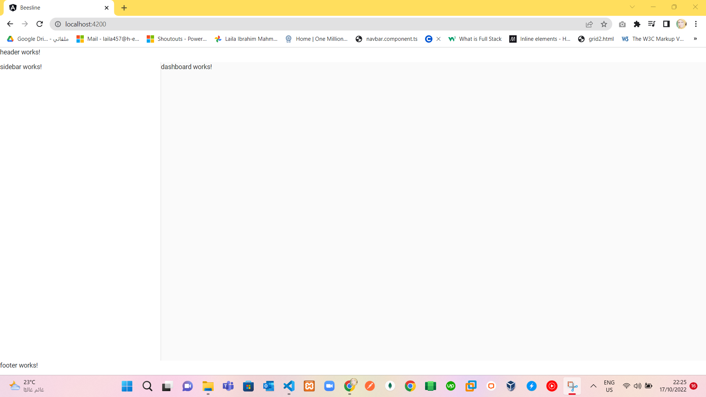

   with path `products` as in:
   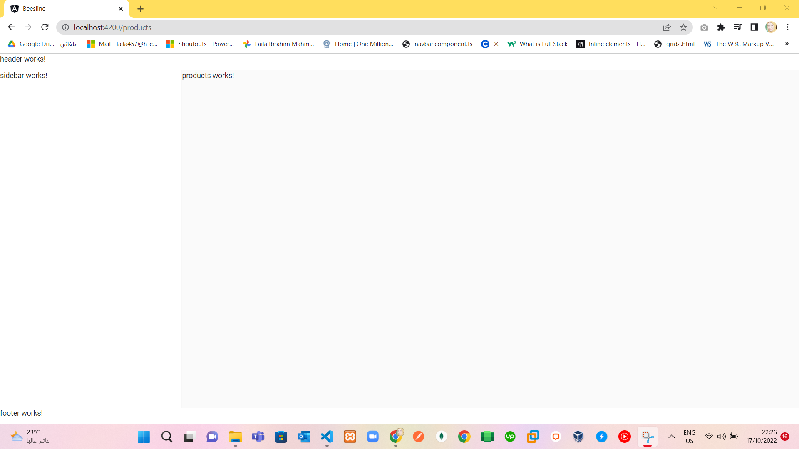

   with path `orders` as in:
   
  
  25. design footer component for testing Now (mean that might be changed) :) As in:
   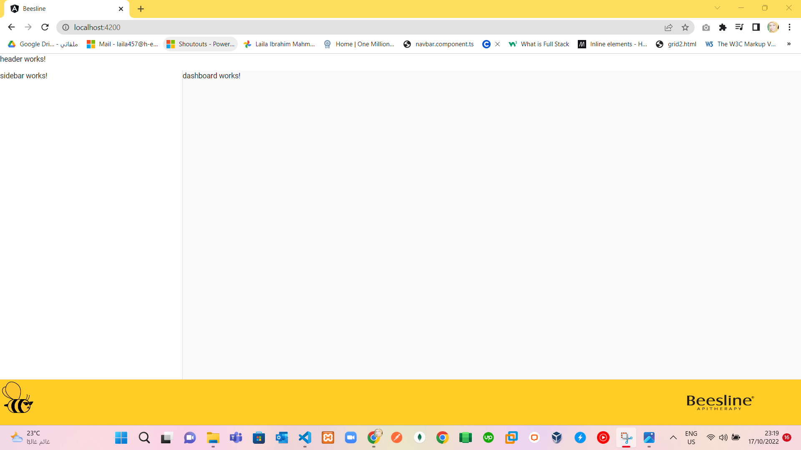

  26. design Header component :) as in:
   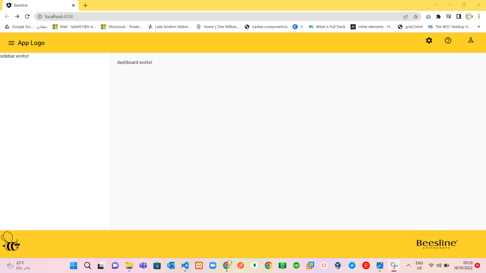

  27. design Dashboard Component (Not Final) 
 
  28. design SideBar Component as in: 
   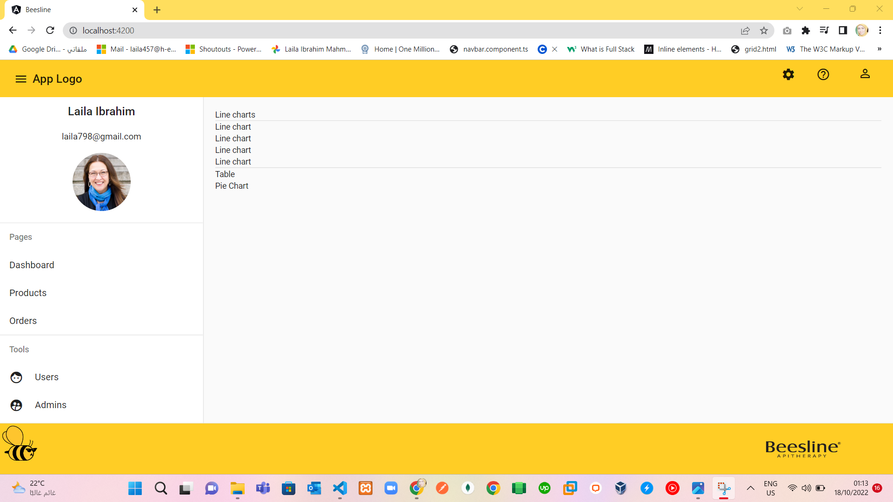

  29. Now make sidebar button dynamic `open` and `closed`: 
   - In `default.component.ts` add `SideBarOpen=true` by default, In `default.component.html` add binding  by `[opened]="sideBarOpen"`.
   - In `header.component.html` and `click` event with `toggleSideBar()` that should emit an event by `(click)="toggleSideBar()"`.
   - In `header.component.ts` emit an event using eventEmmiter and Output :).
   - In `default.component.html` add binding `<app-admin-header (toggleSideBarForMe)="sideBarToggle($event)"></app-admin-header>`
   - In `default.component.ts` add sideBarToggle() for vise the value of `SideBarOpen`.
   - finally , make side bar dynamic open and closed when someone click on menu icon :)).
 
 30. Design Dashboard and its charts :) 
   - `ng g c shared/widgets/area` and draw area chart as in:
     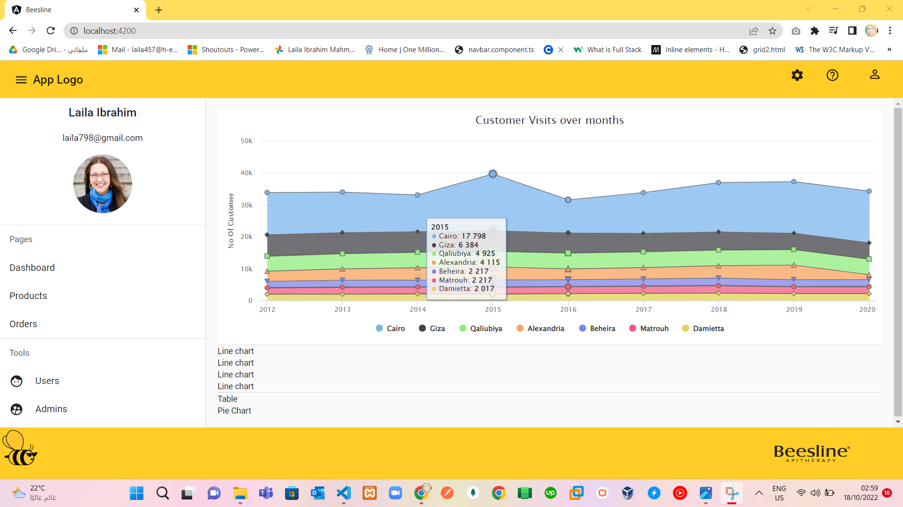
   - Make the area chart Exporting by `HC_exporting` , Export as image,pdf,svg or print :)).
   - `ng g c shared/widgets/card` to draw states as in:
     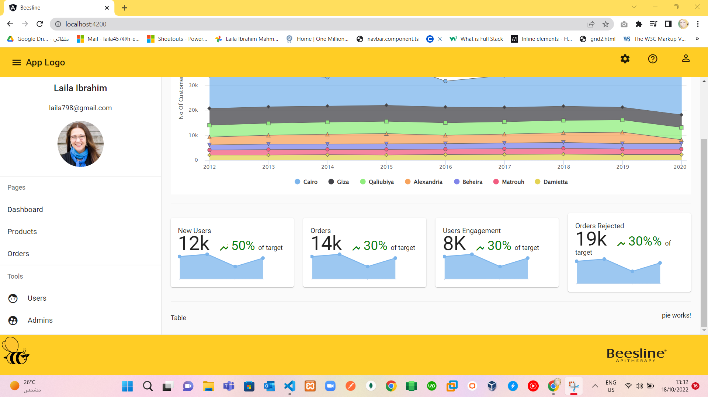
   - `ng g c shared/widgets/pie` to draw a pie chart alongside table :) create new service to handle data in all charts `ng g s modules/dashboard` add this service in providers of `default.module.ts`.
    
  31. Now we need to make Table of users and all types in the dashboard by default :) as in: 
    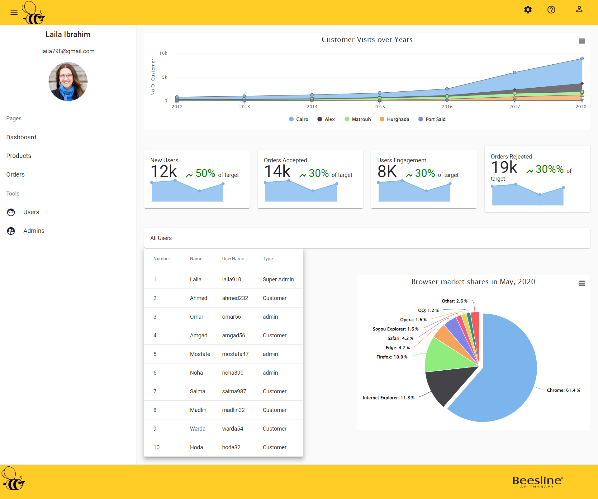
  
  32. Start with build Product Table :) first create table component for products :) `ng g c shared/widgets/PrdouctsTable`

  33. finish products Page structure as in:
   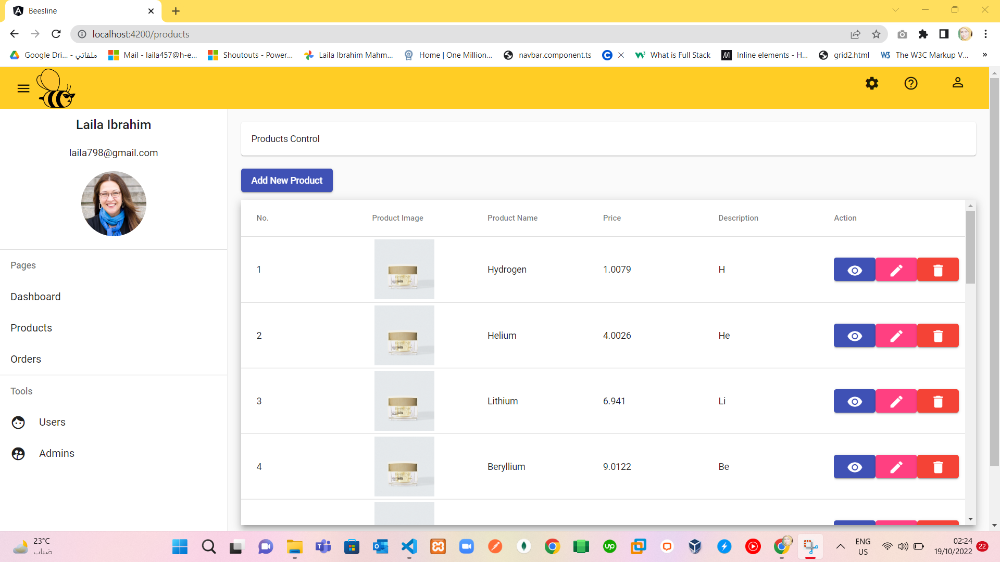

  34. Orders page Structure by create component for table :) `ng g c shared/widgets/OrdersTable`.

  35. finish orders page structure :)  as in:
   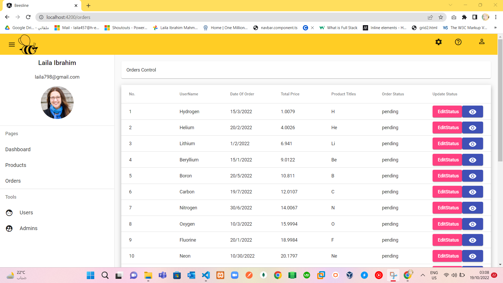

  36. start add product by creating `ng g c shared/widgets/addProduct` and adjust routing for this component and import in default module `ReactiveFormsModule`.
    - when user click on `add product` button in `products` page, page redirect directly to `addProduct` page as in:
    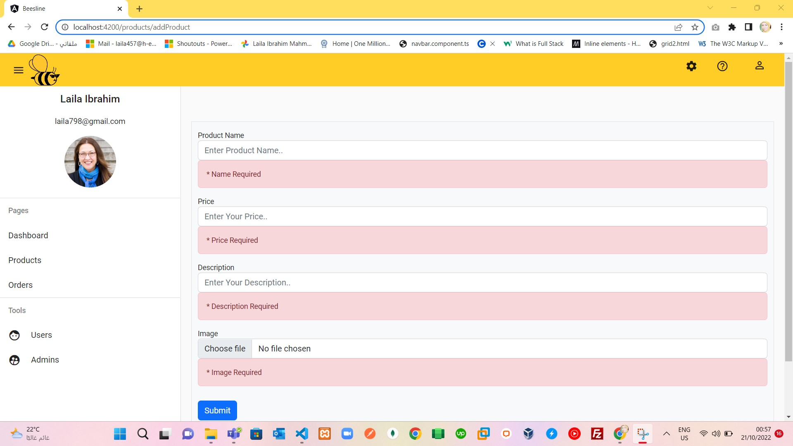
    - when user enter valid data, as in: 
    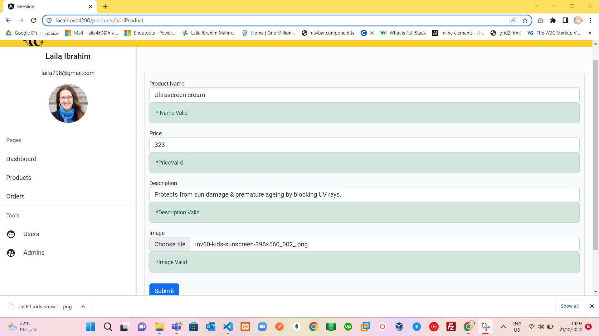
    - when user click on submit button the data will be showing in the products table :)

  37. edit product form `ng g c shared/widgets/editProduct`.
    - if you click on `pin` button to `edit` product,it will redirect to `edit page` to edit product with the previous data as in:
     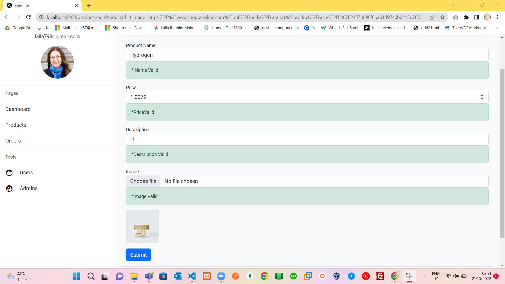
    

  38. Show product Details `ng g c shared/widgets/productDetails`.
    - if user click on any `eye` button,it will redirect to `product details ` page as in:
     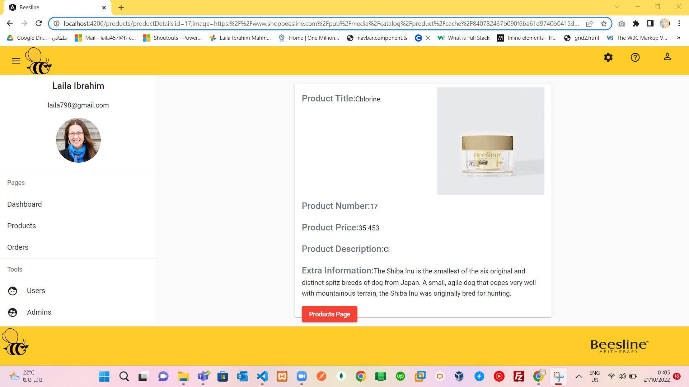
    - After edit Product Data, it will redirect to products Page with the new Data and insert it in products Table :)

  39. remove product by splicing element from array.

  40. Show order details `ng g c shared/widgets/orderDetails` and change order status `ng g c shared/widgets/changeStatus`.
   - when user click on `eye` button to show any order Details, it will redirect to `order Details` page as in:
    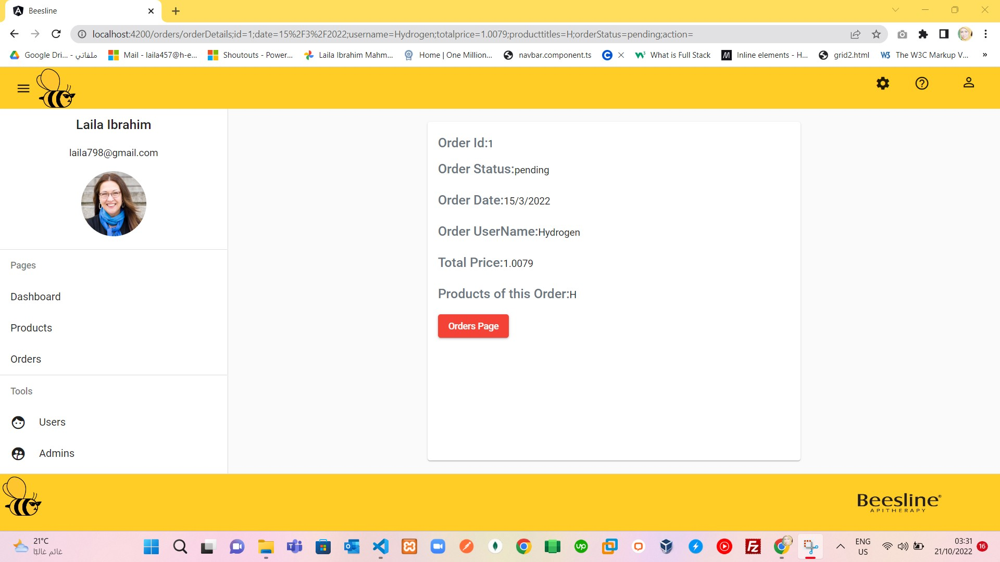.
   - when user click on `edit status` button to change the status of order, after the user change status. it will redirect to `orders` page and insert the new order status. 
   - `changeStatus` order page as in: 
     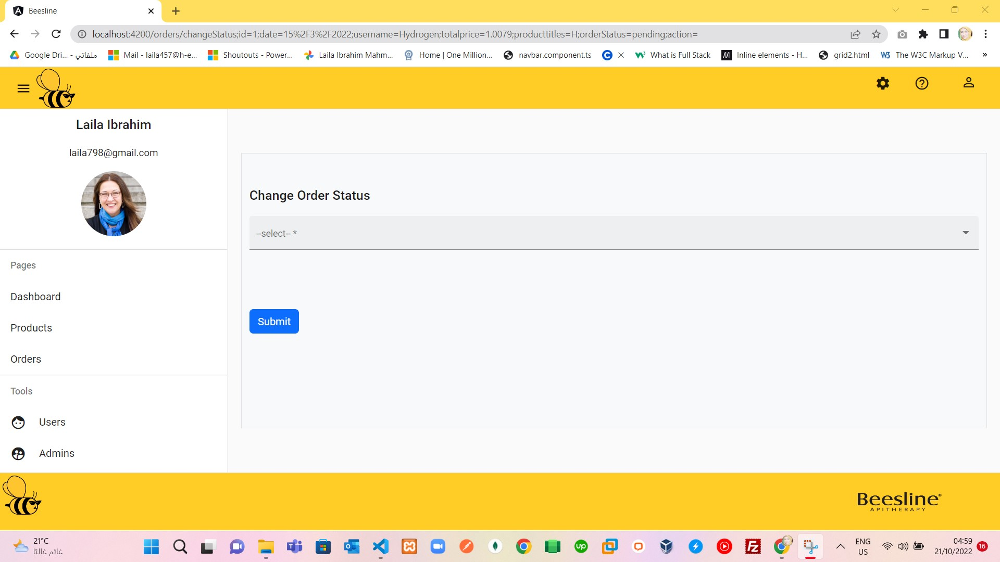

 

